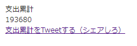

# fanza-total-spending-extension

[FANZA購入履歴](https://payment.dmm.co.jp/history/)からこれまでFANZAに費やしたお金の総額を調べることができます。

## 導入 & 使い方

1. [Releases](https://github.com/ekuinox/fanza-total-spending-extension/releases/)から最新のrelease.zipをダウンロードし展開する。

2. [chrome://extensions](chrome://extensions)で「デベロッパーモード」を有効化する。

3. 「パッケージ化されていない拡張機能を読み込む」から1で展開したフォルダを読み込む。

4. [FANZA購入履歴](https://payment.dmm.co.jp/history/)にアクセスして、右上に追加された赤い字のボタンを押す。

5. 数秒後に結果が左下に表示される。

**シェアしてくれると嬉しい！！！！**

## 注意

1. FANZAの月別の購入履歴が存在するだけリクエストをかけているため、怒られるかもしれない
2. ボタン押した分リクエストが飛ぶ
3. 怒られてもおれは知りません

## 開発

1. `$ git clone git@github.com:ekuinox/fanza-total-spending-extension.git`

2. `$ npm i`

3. `$ npm run build`
